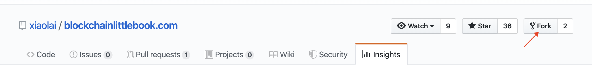
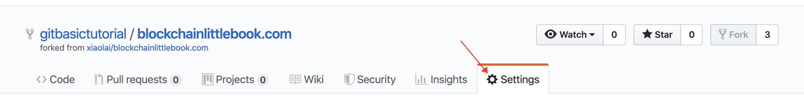
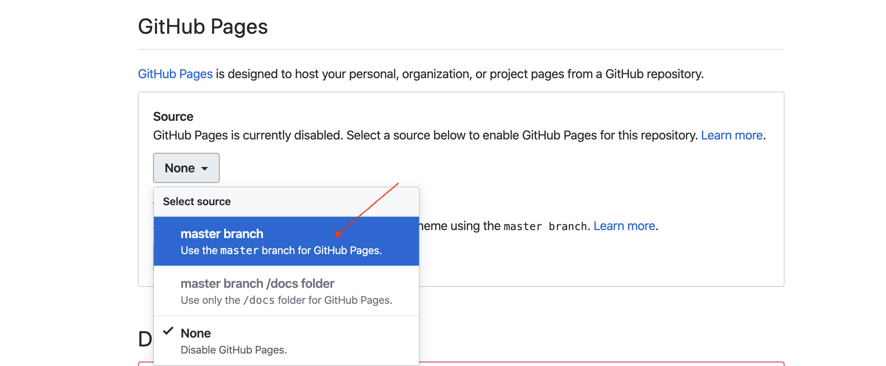
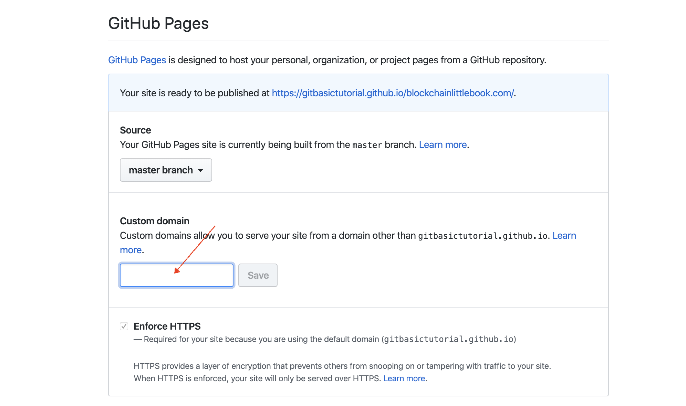
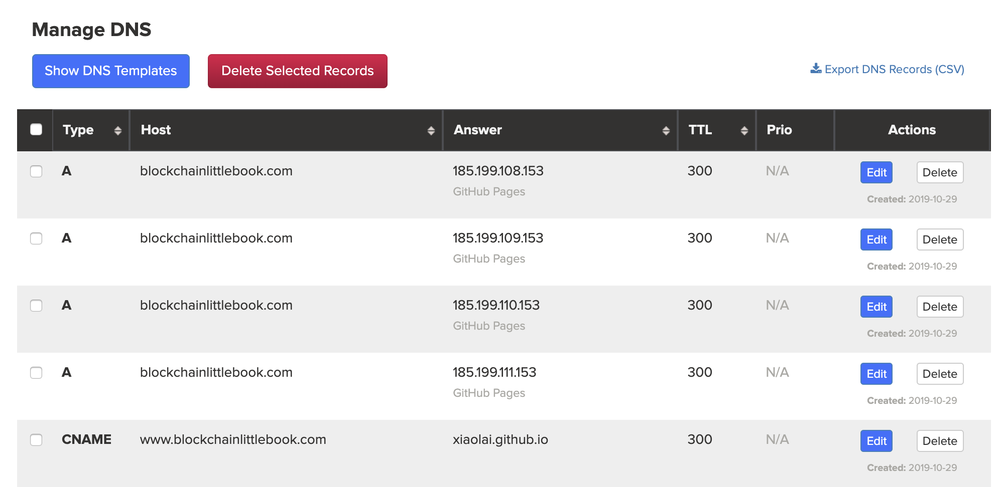

# 从0认识区块链

[猫咪区块链]（著）&copy;（修改中，未传播，禁传播）

-----


## 前言


> 
>有很多人用什么“高速公路”“奶奶记账”去讲区块链，我十分不认同，听者可能理解了你的故事，但回头一想，仍然不知道区块链是什么。
本系列以记录历史的形式，通俗易懂的语言，不涉及难懂的技术词语。帮你理解区块链的诞生与未来。
> 


## 区块链源于比特币

区块链是当初用来解决比特币的创造过程中遇到的困境，它是比特币的结果，后来被世人发现其价值远大于比特币。

### 1. 比特币的由来

2009年一个叫中本聪的人将比特币带到这个世界上。

中本聪最初因不满美联储随意滥印货币，以及频繁发生的金融危机。于是他就想创造一种数量一定，且便于交易，无国界的电子货币。

于是在他创造过程中，遇到了这么几个问题：

> 人们凭何相信它的数量一定？

> 这种货币的交易记录如何记账才能保证绝对不会出现错误？
---------------------------------------------------------------------------------------------------------------------
解决方案：

> * 开放程序源码，且任何人都可以随意访问查看该货币包括数量在内的任何数据。
> * 我不设立服务器帮你们记账了
    * 你们所有人一起来记（记账的人后来称为节点）
    * 每个人一本账本，且每个人的必须相同（用电脑运行一个比特币程序即可自动参与记账）
    * 这样谁想记录新的数据就需要获得其他账本超过半数的同意
    * 当记账的人多了，分散了，黑客是不可能完全控制超过半数的账本的
    * 因此，当有新的交易需要被记录时，超过半数的记账的人达成共识这笔交易才能被记录进网络，算作有效。（这十年来的安全运行证明此方法可行）
    
在上面解决方案中，又遇到了一个新的问题，人们凭什么要提供电脑运行比特币程序来记账。吃饱了闲的？电脑不用了早都关机了。

新的问题的解决方案：
> * 谁运行比特币程序参与记账，就给谁报酬，只不过这里给的报酬是比特币，而不是美元。

#### 报酬从何而来？

> 第一部分：手续费。任何人在进行比特币转账的时候都需要付出一定的手续费，而这部分手续费就作为报酬付给了记账的人。
> 
> 第二部分：因为比特币网络最初知名度不够，没什么人进行交易。于是中本聪设计了另一种激励机制，就是谁每次打包记账了交易可以获得除了手续费额外的一个固定奖励50个BTC（这个固定奖励每4年减半，最终只能依赖第一部分手续费来激励）
    
    
### 2. 何为区块链？何为挖矿？

前情回顾：上篇讲解了比特币的创造原因以及过程，区块链源于比特币。

首先“区块链”这个词是由英文Block chain直接翻译而来。上篇讲到比特币的奖励机制，是将交易记录下来的人获得奖励，而交易不是一笔一笔的记录的，而是每十分钟记录一次交易，把这十分钟内的交易一起“打包”起来，同时记录到比特币网络上，而这个打好的“包”就被说成了“区块”，那么一个“包”接着一个“包”的出现，连在一起，就形成了所谓的“链”，你品，你细细地品，“区块链”这个词就是这么来的。

> 为什么是十分钟呢？因为中本聪设计共识机制的时候就是这么规定的。

#### 何又为共识机制？
> 就是参与区块链网络记账的人（节点）如何对新的交易记录下来，达成这笔交易是正确无误的共识的一种算法。

前文提到谁记录下来交易就给谁奖励。这样就又有一个问题：怎么决定让谁来记账？

#### 怎么决定让谁来记账？

> 比特币用的共识机制被称为POW。POW对上面问题的解决方案就是设置一道很难的计算机题目，哪台计算机先算出正确答案，那么这10分钟内的交易就归你记，奖励也归你。
> 这样的话谁的计算机运算更厉害，谁就更有机会获得记账权。而这个抢夺记账权的过程后来就很形象的被叫作“挖矿”。

十年前比特币网络运行前期没有什么人参与，也就没有什么算力竞争对手，随便一台电脑就能很快挖很多个比特币。而随着比特币越来越值钱，如今算力竞争已经很大了，不专门定制针对比特币计算机难题的计算机（矿机）是很难争得记账权了。

有的小伙伴可能已经有疑问了：为什么这十年来比特币网络的算力竞争涨了这么多，但还是得10分钟才能把难题解出来？
因为比特币网络会自动根据全网算力来调节题目的难度，确保10分钟出一次答案，也就是10分钟记录一“包”交易。
### 3. 比特币解决了什么问题

如果你有兴趣耐心反复阅读比特币白皮书，《[比特币：一种点对点的电子现金系统](https://github.com/xiaolai/bitcoin-whitepaper-chinese-translation)》，那么你就会发现一个你之前并不了解的概念是它的核心：

> 双花问题（[Double Spending](https://zh.wikipedia.org/zh-hans/%E9%9B%99%E9%87%8D%E6%94%AF%E4%BB%98)）

简单讲，就是“同一笔钱一次只能花在一个地方”，“绝对不能让同一笔钱竟然同时花到了两个地方”，否则就只能是 “记账有误”。银行的核心业务是什么呢？银行的最核心业务其实只有一个，那就是：**记账** —— 绝对不能记错账，更不应该做假账。

数字时代的尴尬在于，传统中心化管理的数据库，用来记账的时候，那账簿是有无数种可能被篡改的，账本上随意增加一条不合理的记录、随意删除一条不合规的记录，随意修改任何记录中的数字，都有可能违规且干脆无法防范……

那怎么办呢？比特币这家世界银行的解决方案很简单：

> * 我不自己管理数据库了；
> * 把这个数据库的管理权限交给所有人，大家共同维护这个账簿；
> * 每个人手中所持有的账簿必须与其他人的一样才算有效账簿；
> * 所以，全网所有的账簿都只能一样；
> * 所以，没有人可以私自篡改账簿并被所有其他人接受……

如此这般，就保证了这家世界银行的账簿不可能出错，不可能被恶意篡改，不可能再出现任何 “同一笔钱竟然同时花在两个地方” 的情况。

于是，逻辑就很清晰了：

> * **问题**是 “必须要有一个不可篡改的可信账簿……”
> * **解决方案**是 “那我们分布式管理罢！”

你看，“去中心化” 并非目标，而是分布式管理的结果；而 “公开透明” 也只是分布式管理的自然而然的结果…… 多年以来，不明就里的人们总是神话 “去中心化” 带来的颠覆，总是神话 “公开透明” 的各种优势 —— 其实是本末倒置了。去中心化指的是网络结构去中心化，不会直接带来任何颠覆。而公开透明，固然在一些地方必需必要，但，事实上绝大多数商业模式在公开透明的方式下无法良好运营。别说商业模式了，连游戏都是这样的，猜大小游戏可以一直公开透明，可棋牌游戏，必须等到游戏结束之后才可以公开透明，否则游戏就无法进行了……

### 4. 区块链究竟是什么

区块链是 blockchain 这个英文新词汇的 “生硬翻译” —— 事实上，绝大多数翻译就是很生硬的，你看看上面的 “双花”（Double Spending）就能感觉到了。

所谓**区块**，是 *block* 的翻译，可以理解为 “信息块”（这个单词在计算机领域就是这个意思）。

> **block**, *Computing*: a large piece of text processed as a unit.

如此这般，**区块链**（blockchain）就是字面上的意思，它就是由前后链接起来的信息块构成。

在比特币这家世界银行的设计中，区块（block），就是一个又一个不断生成的**子账簿**，这些子账簿通过一种特定的算法（哈希算法）前后链接起来，形成**总账簿**（blockchain）。从这个角度望过去，区块链技术没什么神秘的，通俗地讲，它只不过是一种新的记账技术而已。

比特币这家世界银行，就是这样建立在区块链技术上的第一个分布式应用。而区块链技术，通俗地讲，无非是个不可篡改的分布式数据库技术而已。

### 5. 区块链技术会改变世界吗

在一些场景下，这个世界的确需要不可篡改的数据库技术。比如，法院的卷宗，交通部门的违章记录，工商部门的企业登记，民政局的婚姻登记，公安局的身份证，大学的毕业证，等等等等……

尤其需要区块链技术的领域，除了**公共事务领域**之外，还有**物联网**。机器产生数据的速度和数量都远远超过人类，而机器数量未来也会必然远远超出人口的数量不止几个量级…… 面对未来不可想象地庞大的物联网世界，不可篡改的数据记录绝对不可或缺 —— 甚至可以说，没有区块链技术，未来的物联网世界不可能安全发展。

所以说，区块链技术的确会改变世界。

不过，至于区块链技术究竟在将来会把这个世界变成什么样子，今天的我们很难准确预测。历史证明，每次技术革新出现的时候，我们的想象力都极为匮乏，我们的预测能力都聊胜于无。三四十年前，人们想象互联网是这样改变世界的：

> 到时候你给别人写信，就会变成这样：你在这边敲完，那边的打印机就自动把整个信件打印出来了……

事实上，没有任何一个专家能在四十年前想象出我们今天可以拿着一个掌中设备坐在家里点两下一会儿外卖就送到门口了…… 所以，过多的预测和想象，实际上是徒劳无益的。

### 6. 挖矿是怎么回事

比特币这家世界银行想出来的维护账簿的方式是使用分布式网络，那么就需要吸引足够多的节点来参与 —— 节点数量越多，网络越安全。可问题在于：

> 人家凭什么来参与呢？

所以，比特币这家世界银行吸引大家参与分布式网络建设的方法是：

> **每 10 分钟左右发一次 “红包”**……

这里的 “10 分钟”，是因为比特币这个分布式网络每十分钟要完成一个子账簿（就是一个区块），而后把这个新的子账簿附加到原来的总账之中（即，区块链）。生成、校验子账簿，并且确认无误地附加到原来的总账之中，这个过程需要网络中的节点贡献算力。而算力并不是白白贡献的，大家干活了之后，就可以参与 ”抢红包“！

比特币这家世界银行通过不断地 “发红包” 完成了它的货币发行 —— 按照程序最初的设定，比特币这家世界银行（Bitcoin）要持续发红包 142 年！刚开始的时候每 10 分钟左右发 50 个比特币（BTC），以后每 4 年减半一次，每个 “红包” 里的比特币数量从 50 个减成 25 个，后来再减成 12.5 个，6.25 个…… 以此类推。比特币（BTC）总量为恒定的 2,100 万个 —— 红包全部发完之后，参与网络维护的节点依然可以通过分享网络转账手续费而获益。

通过架设比特币节点获利的过程，被人们形象地称为 “挖矿”（mining），而参与建设节点的那些人被人们称为 “矿工”（miners）。因为 “抢红包” 是有一定运气因素存在的行为，所以，矿工们会集中挖矿，方式是把自己的节点算力集中到一个 “矿池”（mining pool）之中，以便增加自己抢红包时的运气。目前全球排名第一的矿池是[币印矿池](https://poolin.com)。

十年前，比特币网络刚刚运行的时候，参与人数少，总算力也很低，那时候随便用一台笔记本电脑就可以 “挖” 出很多比特币 —— 当然，那时候的比特币也不值钱…… 第一笔比特币交易是，有人用 10 万个比特币买了 2 个披萨！


> 上图来自：https://www.blockchain.com/charts/hash-rate?timespan=all

时至今日，比特币网络算力已经大到惊人的地步，不使用专门定制的计算机（所谓 “矿机”）是很难 “挖” 出比特币的。矿机的发展，经过了 CPU 时代，GPU 时代，早就进入了 ASIC 时代，并且，从 128 纳米的芯片几经升级，目前已经有公司在研究 7 纳米、甚至 5 纳米的比特币挖矿芯片了。

### 7. 比特币凭什么涨啊涨

如果你能把比特币（BTC）理解为 “一个叫作比特币（Bitcoin）的分布式世界银行应用” 的股票，那么就比较容易理解比特币（BTC）的价格上涨趋势了。

.png)

> 上图来自 https://www.blockchain.com/charts/market-price?timespan=all

这个叫作比特币（Bitcoin）的分布式世界银行应用就好像是一家上市公司，它的核心业务只有两个部分：发行和记账。而它的价值取决于有多少人认同它、使用它 —— 在这一方面，地球上任何一家银行都如此。截至 2019 年，全球使用比特币的人数不超过 3000 万，相对于整个人口数量，这依然是个相当小的比例。所以，它还有很大的上涨空间 —— 只不过，在任何一个短期之内，上下波动都非常剧烈，所以，普通人参与投机的风险非常高。

### 8. 区块链有没有被篡改的风险

事实上，仅仅分布式管理本身，是无法做到 “无法篡改” 的 —— 顶多能做到的是 “很难篡改”。假设全网诸多节点中有 51% 的节点联合起来 —— 不管是善意还是恶意，反正都是故意 —— 那么这些节点 “合谋” 的结果就是该数据库不再是 “不可篡改” 的数据库。

以上所描述的情况，就是所谓的 “51 攻击” —— 这并不是技术能够解决的问题。区块链的第一个应用，比特币，解决这个问题的方式，同样不是靠技术，而是靠利益驱动（博弈原理）：

> 若是真的有谁能够操纵 51% 的算力，那么他会发现，对他来说，“贡献” 远比 “攻击” 更有利可图。

### 9. 小白如何购买比特币

目前世界上对小白最友好的多币种钱包是 [Mixin Messenger](https://mixin.one/messenger)，它不仅支持你所能听说过的绝大多数数字资产收发与存储，并且使用极为方便。

Mixin 下载方式：

> * iOS
>   * 国内用户，在 iTunes [下载 Mixin 畅聊版](https://apps.apple.com/cn/app/mixin-%E5%AF%86%E4%BF%A1%E7%95%85%E8%81%8A%E7%89%88/id1457938019)
>   * 国外用户，在 iTunes [下载 Mixin Messenger](https://apps.apple.com/app/mixin/id1322324266)
> * Android
>   * 国内用户，在[腾讯应用宝下载](https://a.app.qq.com/o/simple.jsp?pkgname=one.mixin.messenger)，或者[小米应用商店下载](http://app.mi.com/details?id=one.mixin.messenger)
>   * 国外用户，在 [Google Play Store 下载](https://play.google.com/store/apps/details?id=one.mixin.messenger)

iOS 国内用户下载的 [Mixin 畅聊版](https://apps.apple.com/cn/app/mixin-%E5%AF%86%E4%BF%A1%E7%95%85%E8%81%8A%E7%89%88/id1457938019) 需要添加小钱包机器人（ID: *7000101425*）才能使用数字资产收发存储功能。


在 Mixin 里提供 OTC 服务的是 exin，机器人 ID：7000101276。

你也可以到 [https://big.one](https://big.one) 或者 [https://b1.run](https://b1.run)，这是国内老牌交易所云币团队打造的有信誉保障的区块链数字资产交易所，可以使用 USDT 购买比特币，它也有 [OTC 服务](https://otc.b1.run/trade)。另外，Big.One 的 Mixin 大群 ID 是：*7000101910*。

再次需要提醒风险：

> 区块链数字资产价格波动巨大，**投资有风险，决策需谨慎！**

另外，对小白来说最靠谱的投资策略是**定投策略** —— 至于具体应该如何操作，请移步[《定投改变命运》（开源第三版）](https://onregularinvesting.com)。

## 区块链

自从比特币横空出世之后，支撑比特币的底层技术，即区块链技术引起了巨大的关注。人们开始琢磨：“这个区块链技术还可以用在什么地方呢？”  —— 当然，人们琢磨得最多的还有另外一个问题：“我应该如何获利呢？”

### 1. 山寨币

2009 年至 2017 年之间，至少有几千个山寨币出现，而后批量死亡。所谓山寨币，就是对比特币进行了事实上并没有什么用的改造，然后取一个什么名字，然后就发布的所谓下一个比特币，下一个机会……

有一个山寨币，对比特币进行了最没用的改造 —— 只是把确认时间从 10 分钟改成了 2.5 分钟 —— 却最终顽强地活了下来…… 它叫莱特币（Litecoin）。也许是它的宣传语太吸引人了吧，它说，比特币是金，我们莱特币是银。于是，大量觉得自己错过了比特币的人，购买了莱特币…… 你看这世界多有趣，它总是有一定的容错机制。

### 2. 公链

2015 年年底，[以太坊](https://www.ethereum.org/zh/)开始融资；2016 年，云币成了地球上第一个上架交易以太坊的交易所…… 2017 年，以太坊成了最火爆的区块链项目。

以太坊想要解决的问题是什么？又，解决的足够好吗？

历史证明，以太坊是一次并不成功的尝试 —— 它想要成为一个区块链技术应用平台，在这个分布式的 “计算机” 上，有它自己的编程语言；用这个特定的编程语言写的程序被称为 “智能合约”；人们可以在以太坊这个平台上发布各种基于区块链技术的应用…… 也就是说，它想要成为一条公链（Public Chain），顾名思义，就是公众都可以使用的区块链。

以太坊所遇到的困难，其实是它尚未诞生之时已经被质疑的东西：使用 [PoW](https://en.wikipedia.org/wiki/Proof_of_work) 共识机制的一条 “公链” 就是难以承载真正有意义的大规模应用。即便是以太坊的 PoW 被设计成十几秒之内确认一次，不要高兴得太早，10 分钟和 10 几秒事实上没什么区别 —— 因为真正有意义的大规模应用需要的是每秒钟成千上万次确认才可以……

缺陷最大的是以太坊独立设计的编程语言 Solidity，虽然最初的时候最大的宣传点是它 “图灵完整”，可事实上，并没有什么用，为什么呢？因为不管谁写的编程语言都一样，都难免有臭虫（bug）…… 可问题是，这种编程语言是用来写所谓 “智能合约” 的，这种程序是直接涉及到钱的，于是，只要有问题就会被攻击。以太坊上线没多久，有个叫作 DAO 的项目就被黑客攻击转移走了大量的资产，以太坊只好以 “紧急分叉” 来 “解决” 问题，于是遗留了一个今天人们不知道那是用来干什么的 ETC（Ethereum Classic），新的币叫作 ETH。

虽然以太坊计划将共识机制从 PoW 更新为 dPoS，但它现在面临两个问题：1. 如此这般的话，那么只能再次分叉，新的币叫什么好呢？老的币又能干什么呢？对技术人员来说是困扰，对投资者来说是未知的风险；2. 基于 dPoS 机制的，有多线程支持的分布式计算平台 [EOS](https://eos.io) 早已于 2018 年 6 月正式上线……

### 3. 共识机制

首先，在这里请注意，我们所讨论 “共识” 是网络中节点之间的共识，是机器与机器之间的共识，而不是人与人之间的共识。人与人之间的共识与区块链没有任何关系 —— “共识” 这个词常常被人们误用、滥用。这也是为什么我曾经戏谑地说 “傻屄的共识也是共识” 的原因。我想说的是，傻屄们死活搞不懂，那不是人与人之间的共识，然后吧，他们还总是不懂装懂……

区块链本质上来看就是一个分布式管理的可不断添加记录却不能删除记录的数据库。由于是分布式维护，所以，每次添加记录的时候，要在网络节点之间达成共识，确认要被添加的记录有效之后才能进行添加操作。

比特币所采用的共识算法是 PoW（Proof of Work，工作量证明机制），简单讲，就是网络中的节点根据自己的贡献获得权益，多劳多得。PoW 在比特币这个区块链技术的第一个应用之中是完美无缺的，可是，正如你所看到的，对野心在于 “创建一个分布式计算机” 的以太坊来说，PoW 就成了致命缺陷 —— 无论如何，这种机制的新记录确认速度就是满足不了现实需求。

dPoS（[Delegated Proof of Stake](https://en.wikipedia.org/wiki/Proof_of_stake#Delegated_Proof-of-Stake)）是 PoS（[Proof of Stake](https://en.wikipedia.org/wiki/Proof_of_stake)）的进一步改良。简单讲，就是你作为持币者，可以通过持有量和持有时间的多少获得权益。PoS 的问题在于，大多数持币者并没有专业知识，也不见得有足够的预算，于是，他们不见得能提供高性能节点所需要的计算机硬件和软件要求。于是，进一步改良的 dPoS 采用了基于投票选举的共识算法，持币者选出若干个节点来运营网络…… 

小白对更多的技术细节可以直接跳过，需要弄明白的是，PoW 无法支撑公链的需求；而 dPoS 是 EOS 创始人 Dan Larimer 的创新概念，PoS 从 2014 年的 [BitShares](https://bitshares.org/) 时代就开始验证，后来经过若干次更新改进，变成了 dPoS。你可以将 dPoS 理解为一次为了平台性能相对于 PoW 而作出的妥协，而这个共识算法目前来看是公链的最靠谱选择之一。

### 4. 山寨链

正如曾经山寨币群魔乱舞一样，2017 年开始，各种山寨链神出鬼没。各种名称的共识机制漫天飞舞，Po 两个字母之后，从 A 到 Z，全被用光了，各种 PoX（Proof of something）…… 它们真的有存在的必要吗？这些山寨链欺负普通民众不懂编程，大面积抄袭，反正抄袭已经没戏了的以太坊不划算，于是只能抄袭已经证明为较为靠谱的 EOS。事实上，除了这两个项目之外，抄袭者们也没有什么其他的选择。正如当年山寨币除了抄袭比特币之外也没有任何其它选择一样。

这世界是有容错机制的，山寨比特币的莱特币顽强存活到了今天；也许，那些抄袭 EOS 的各种项目之中，也会有那么一两个最终幸存？到底哪一个能够最终幸存我们没办法提前知道，但，我们知道的是，抄袭不可能超越。所以，山寨项目是留给那些想不明白的人的，不是吗？

### 5. 目的与手段

正如你所见，打造一个不可篡改的分布式数据库，是**目的**；而区块链技术，是达成这个目的的**手段**。再进一步，所谓共识机制，是区块链技术的一部分；除了共识机制之外，还有另外一个重要的组成部分，奖励机制 —— 否则人们不会自动对网络有所贡献。

长期以来，所谓的技术创新基本上都聚焦在了如何改进共识机制之上，而奖励机制被默认为 “不可或缺” 的组成部分。人们以为，共识机制和奖励机制就好像是区块链这架马车的两个轮子一样，缺一不可。

有没有可能去掉奖励机制呢？然而，在此之前，还要问另外一个问题：为什么要想办法去掉奖励机制呢？

我们之前提到过，乍看起来区块链技术应该被应用到很多地方：

> 在一些场景下，这个世界的确需要不可篡改的数据库技术。比如，法院的卷宗，交通部门的违章记录，工商部门的企业登记，民政局的婚姻登记，公安局的身份证，大学的毕业证，等等等等……

你看，几乎所有的政务部门都需要不可篡改的数据库技术，可是，你不能让这些部门为了使用区块链技术而天天 “挖矿” 吧？关键矛盾在于，公共事务领域反正不是也不应该是靠利益刺激运行的。

看来，在一些场景下，有必要去掉奖励机制 —— 可如何做到呢？冯晓东设计的 Mixin Network 提供了一个解决方案 —— 它的非商业非营利版叫作**恒信网络**（HengXin Network）。

恒信网络是世界上第一个已被证明为可行的**无币区块链解决方案**。

恒信网络通过使用 TEE（Trusted Execution Environment，可信执行环境）生成了一个由中心化管理渐进为去中心化管理的可以无需奖励机制的分布式网络。除了 TEE 之外，恒信还结合了 DAG（Directed Acyclic Graph，有向无环图）为基础，辅以 ABFT（Asynchronous Byzantine Fault Tolerance，异步拜占庭容错）算法作为解决方案，构造了一个成本低廉，易维护、易使用，性能高，兼容性强的不可篡改的分布式网络。

TEE（[Trusted Execution Environment](https://en.wikipedia.org/wiki/Trusted_execution_environment)，可信执行环境）的作用是，向公众证明网络中某个节点（或称服务器） “正在运行的代码” 的确是 “它声称正在运行的代码”。简单来说，你可以把具备可信执行环境的服务器理解为一个透明盒子，外部可以 “看到” 它内部正在运行的代码 —— 换言之，没有任何人能够在不被察觉的情况下改变这个透明盒子里正在运行的代码。

网络设计者可以自己在网络上部署一定数量的“透明盒子”，如此这般构成一个 “类自治” 的分布式网络 —— 这个时候，这个网络虽然已然是分布式网络，但依然是中心化治理的，因为那些透明盒子是网络设计者自己部署的。

然而，这时这个网络已经具备一定的 “自治” 特征，因为每个节点都是透明的，所以，即便是网络设计者本身也无法做到在他人不知情的情况下修改节点中正在运行的程序……

再进一步，这个网络是开放的，任何人都可以使用具备可信执行环境的服务器加入网络充当节点 —— 这里的关键在于，加入者是因为需要这个网络、需要这个网络所提供的服务才加入的，而不是因为网络设计者对加入者有所激励 —— 需要注意的是，恒信网络没有奖励机制。

加入者越多，网络越健壮，安全性也会因此越来越高。当网络的节点达到一定数量之后，网络设计者可以撤掉自己当初部署的节点，把整个分布式网络全部交由自由加入的节点管理…… 至此，一个自治的、非中心化管理的分布式网络终于形成。

恒信网络的商业版，Mixin Network 于 2019 年 2 月主网正式上线，迄今为止（2019 年 11 月）性能稳定；已无故障运行 9 个月。

#### a. 支持大规模高并发

与传统区块链不同，恒信网络使用的是  DAG（[Directed Acyclic Graph](https://en.wikipedia.org/wiki/Directed_acyclic_graph)，有向无环图）技术；它没有传统的区块概念，它以每一笔交易为单位，尽可能快的向整个网络进行指数级广播，与此同时，避免双花的是ABFT（Asynchronous [Byzantine Fault](https://en.wikipedia.org/wiki/Byzantine_fault) Tolerance，异步拜占庭容错）算法。于是，在恒信网络中，每条交易记录的确认，不再有时间瓶颈，TPS（Transaction Per Second）在恒信网络中是一个完全没有必要存在的概念 —— 恒信网络几乎和中心化服务器一样高效。

#### b. 兼容各种其它公链

由于恒信网络的核心只做记账，所以，理论上它能支持所有公链的资产管理。目前已支持的公链包括比特币、以太坊、EOS、Ripple 等 50 余条公链（数量一直在不断增加）。通过结合使用多重签名算法与异步拜占庭容错算法，用户的公钥与私钥管理被封装了起来，恒信网络的用户只需要通过最多试错 5 次的 6 位数字密码统一管理任何公链上的数字资产 —— 极大地降低了用户使用成本，同时也极大地提高了数字资产的易用性。

#### c. 关于所谓智能合约

与以太坊和 EOS 不同，恒信网络只做资产管理网络。至于所谓的 “智能合约”，在恒信网络中的解决方案是用户使用任何编程语言编写他们的程序，而后将这些程序开源，并运行在具备可信执行环境（具体来说，就是 Intel SGX）的服务器上，公开透明地运行这些程序。这么做的好处是，智能合约与恒信网络本身无关，恒信网络却能提供智能合约（其实就是各种程序）的完全透明运行环境。

## 避开投资陷阱

对小白来说，有个问题非常现实：小白是没有技术能力的 —— 于是，小白们最终只关心一个问题：我如何获利？可问题在于，投资这东西，对小白来说更为险恶……

### 1. 钱包安全

数字资产的钱包，每条公链都不一样，直接导致的结果就是小白们压根弄不明白到底应该用哪个，怎么用？所以，根据过往历史数据来看，绝大多数小白会直接把交易所当作钱包使用。小白们把钱充进交易所，而后买到各种他们想要买的币，而后就存在交易所 —— 因为提出去之后存在哪里呢？顶多，提到其它交易所……

把交易所当作钱包用也不是不行，但，这里面的风险在于，绝大多数交易所做不到像当年的云币那样，从未出现过丢币的安全事故。交易所有真实丢币的，也有监守自盗的…… 所以，真不是随便哪一个交易所都可以当作钱包使用的。[BigOne](https://b1.run) 倒是可以无负担推荐，因为它的确靠谱。

经过多年的发展，区块链世界里的交易所也有了一定的创新，比如，链上交易所，[FoxOne](https://fox.one/)，一切交易都发生在链上，运营方没有作假的可能…… 关键在于，把这个交易所当作钱包使用，是没有负担的，因为按照他们的机制，运营方无法动用用户的币。

对小白来说，最为友好也最为安全方便的多币种钱包是 Mixin Messenger，在之前的章节中已经介绍过。

事实上，最关键的地方在于密码管理。在这件事儿上不要省钱，一定要使用付费服务，比如，我使用的密码管理软件是 [1Password](https://1password.com)。还要养成一个重要的习惯：

> 绝对不能在多个服务或者网站上使用同一套用户名和密码 —— 必须为每一个服务设定独特的密码。

怕忘？就是为了解决这个问题才使用付费的密码管理软件，1Password 会帮你生成独特的密码，并且由它来帮你记住。

### 2. 不懂不投

这个原则适用于任何人 —— 投资自己搞不懂的东西，那就是举着火把在炸药厂里散步，也许你还活着，但下一秒死掉的概率极高。

千万不要误以为技术创新会自动转换为商业价值，千万不要误以为自己的认知已经高到足够保证自己获利的地步 —— 事实上，成功投资总是非常困难的事情，鲜有人做到。

不要被 “xxx 今天涨了 50%” 之类的现象所吸引。由于目前区块链交易市场尚未被合规化，所以有很多项目的币是高度控盘的，控盘的人想让它涨它就真的能涨，想让它跌它就必然能跌，所以，若是你被这样的现象所吸引，那么十有八九你会成为 “杀猪盘” 的牺牲者。

### 3. 只投大盘币

如果你忍不住非要尝试投资，那么，有两个建议：

> 1. 做好长期打算
> 2. 只投大盘币

短期投机难度非常大，绝大多数人的宿命是：“凭运气赚到的钱后来凭实力亏光了……” 所以，你只能选择长期。而后，在眼花缭乱的各种标的之间，究竟选哪个呢？在我看来，小白没什么其它的选择，要么 BTC，要么 EOS，没了！如果想要系统化的投资策略，那么先去认真阅读《[定投改变命运](https://onregularinvesting.com)》若干遍，除此之外也别无其他选择。

### 4. 不要相信各种专家

这个领域太新，又涉及技术，又涉及金钱，所以，这个领域里真正的专家少之又少，与之相对的，骗子数不胜数 —— 并且，你很少会见到专家说别人是专家，却总是见到骗子说别人是骗子。

真假难辨！

那怎么办？既然难辨，咱就不辨了呗！要么自己认真学习技术，认真研究市场；要么就干脆退一步**只相信常识**：

> 脑子热的时候干什么都行，就投资不行！

常识告诉我们，投资是只能在冷静的时候作出决策的。

别怕什么 “被时代落下” —— 大家不都这样么？被落下没什么了不起的。再说，赚钱虽然很难，但，除了冒险投机之外，显然有很多其它可以赚钱的正常方式。

### 5. 谨慎参与合约交易

对于绝大多数不明就里的投机者来说，期货交易所就是个大赌场。加杠杆的期权、期货、合约交易都一样，是风险非常大的交易。专业的做法是在做现货交易的时候，使用期货对冲风险 —— 可绝大多数人只做期货，且不知其风险。

参与期货交易还有另外一个巨大的风险，那就是交易所可能作恶。这非常可怕，因为你的仓位对交易所来说是透明的，在巨大的利益面前，有些交易所或者交易所内部的工作人员会做 “扎针” —— 就是操纵市场价格到恰好能让你爆仓的地步而后恢复价格…… 很多人明明知道自己是怎样吃亏的，却压根找不到可以说理的地方。

所以，参与有杠杆的合约交易是你个人的选择，但有两个建议很重要：

> 1. 不要只做期货；
> 2. 选择靠谱的不作恶的交易所，比如 [BTCMEX](https://www.btcmex.com/)……


-----

## 关于本书

本书不是技术书籍，它很短，它就是想尽量用最简单的方式给小白讲清楚区块链的 “最少必要知识”。

本书内容保存在 [github](https://github.com/xiaolai/blockchainlittlebook.com) 上，点击右上角那个小猫的图标，就可以转至该项目的仓库。

本书完全开源，没有任何协议，你可以任意修改，任意发布 —— 只不过，希望你注意以下两点：

> * 保留原文出处，加上原站链接：https://blockchainlittlebook.com
> * 如若做出了修改，最好在保留原文的情况下，加上醒目的修改标注。

欢迎各种语言的翻译 —— 请提交 pull request。请将翻译文件放置到相应的目录之中，文件仍然命名为 README.md，比如

> /en/README.md
>
> /jp/README.md

**你甚至可以用它做自己的网站！** —— 自己先去买一个域名就好。

在你注册好自己的 github 账户之后，你就可以 Fork 当前这个项目为自己的仓库：



Fork 完成之后，点开 Settings



往下拉，拉到 GitHub Pages 单元，Source 中选择 ```master branch```：



而后在 Custom Domain 中填写你自己的域名（你可以在 [name.com](https://www.name.com/) 上或者[阿里云](https://www.net.cn)上购买域名）：



你需要在域名服务商的页面中，为自己的域名添加以下 4 条 A 记录和 1 条 CNAME 记录：

> A 记录：
>
> * 185.199.108.153
> * 185.199.109.153
> * 185.199.110.153
> * 185.199.111.153
>
> CNAME
>
> host: www
>
> Anser: *your-github-username*.github.io

我的设置如下：



大功告成！几分钟之后，你就可以看到你自己的域名已经生效了，若是你身边有人想要了解区块链，那么你就可以给他属于你自己的链接了。如果需要修改内容，直接在 GitHub 页面里编辑即可……

注意：原仓库会经常更新，所以，你也要将你的 Fork 保持更新：

```bash
git clone https://github.com/gitbasictutorial/blockchainlittlebook.com
cd blockchainlittlebook.com
git remote add upstream https://github.com/xiaolai/blockchainlittlebook.com
git pull upstream master
git push -u origin master
```

## 关于作者

李笑来，投资人，终生成长者。[http://lixiaolai.com](http://lixiaolai.com) · [xiaolai@github](https://github.com/xiaolai)

### 出版书籍

> * TOEFL 核心词汇 21 天突破
> * [TOEFL 高分作文](http://lixiaolai.com/#/twe185/)
> * [把时间当作朋友](http://lixiaolai.com/#/befriending-time/)
> * 通往财富自由之路
> * 韭菜的自我修养（[中文](http://lixiaolai.com/#/the-self-cultivation-of-leeks/cn/) · [English](http://lixiaolai.com/#/the-self-cultivation-of-leeks/en/)）
> * [自学是门手艺](http://lixiaolai.com/#/the-craft-of-selfteaching/)
> * [定投改变命运（第三版）](https://onregularinvesting.com)

### 其它

> * [我也有话要说](http://lixiaolai.com/#/i-have-a-say/)
> * [人人都能用英语](http://lixiaolai.com/#/everyone-can-use-english/)
> * [挤挤都会有的 —— 写给女生的性高潮指南](http://lixiaolai.com/#/ji/)
> * INBlockchain 开源投资原则 ([中文](http://lixiaolai.com/#/INB-principles/cn/) · [English](http://lixiaolai.com/#/INB-principles/en/))
> * [Bitcoin 白皮书（中英对照）](http://lixiaolai.com/#/bitcoin-whitepaper-cn-en-translation/Bitcoin-Whitepaper-EN-CN.html)
> * [区块链小白书](https://blockchainlittlebook.com)
